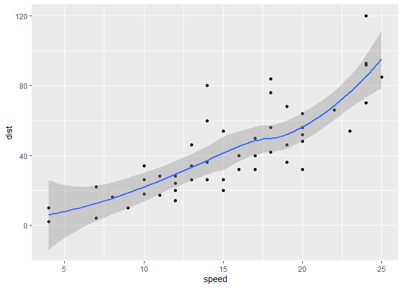
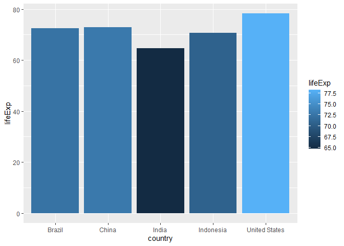
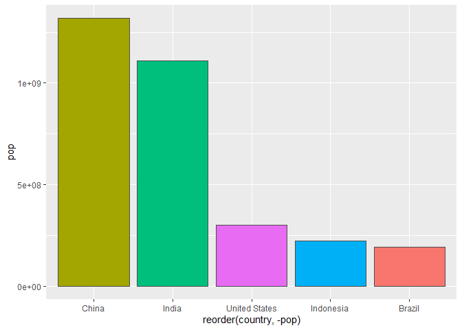

Class 5: Data Visualization
================
Jimmi

# Plotting in R

R has multiple plotting and graphic systems. The most popular of which
is **ggplot2**

We have already played with “base” R graphics. This come along with R
“out of the box”.

``` r
plot(cars)
```


Compared to base R plots ggplot is much more verbose - need to write
more code to get simple plots like the above.

To use ggplot I need to first install the ggplot2 package. To install
any package in R I use the `install.package()` command along with the
package name.

The install is a one time only requiredment. The package is now on our
computer. I don’t need to re-install it.

However, I can’t just use it wihtout loading it up with a `library()`
call.

``` r
library(ggplot2)
```

``` r
ggplot(cars)
```


All ggplot figures need at least 3 things:

-data (this is the data.frame with our numbers) -aesthetics (“aes”, how
our data maps to the plot) -geoms (do you want lines, points, columns,
etc…)

``` r
ggplot(data=cars) +
  aes(x=speed, y=dist) +
  geom_point()
```


I want a trend line to show the relationship between speed and distance

``` r
ggplot(data=cars) +
  aes(x=speed, y=dist) +
  geom_point() +
  geom_line()
```


This is not what we want.

``` r
bb <- ggplot(data=cars) +
  aes(x=speed, y=dist) +
  geom_point() +
  geom_smooth()

bb
```

    `geom_smooth()` using method = 'loess' and formula = 'y ~ x'



``` r
bb + geom_smooth(method = "lm", se=F)
```

    `geom_smooth()` using method = 'loess' and formula = 'y ~ x'
    `geom_smooth()` using formula = 'y ~ x'


# Gene expression example

Read the dataset from online

The ‘head()’ function will print out just the first few rows (6 by
default)

``` r
url <- "https://bioboot.github.io/bimm143_S20/class-material/up_down_expression.txt"
genes <- read.delim(url)
head(genes,10)
```

             Gene Condition1 Condition2      State
    1       A4GNT -3.6808610 -3.4401355 unchanging
    2        AAAS  4.5479580  4.3864126 unchanging
    3       AASDH  3.7190695  3.4787276 unchanging
    4        AATF  5.0784720  5.0151916 unchanging
    5        AATK  0.4711421  0.5598642 unchanging
    6  AB015752.4 -3.6808610 -3.5921390 unchanging
    7       ABCA7  3.4484220  3.8266509 unchanging
    8   ABCA9-AS1 -3.6808610 -3.5921390 unchanging
    9      ABCC11 -3.5288580 -1.8551732 unchanging
    10      ABCC3  0.9305738  3.2603040         up

``` r
nrow(genes)
```

    [1] 5196

``` r
colnames(genes)
```

    [1] "Gene"       "Condition1" "Condition2" "State"     

``` r
ncol(genes)
```

    [1] 4

``` r
table(genes$State)
```


          down unchanging         up 
            72       4997        127 

``` r
round( table(genes$State)/nrow(genes)*100, 2 )
```


          down unchanging         up 
          1.39      96.17       2.44 

``` r
p <- ggplot(genes) +
  aes(Condition1,Condition2, color=State) +
  geom_point() +
  scale_color_manual( values=c("blue", "grey", "red") )
p
```


``` r
p + labs(title="Gene Expression Changes Upon Drug Treatment",
       subtitle="Regulatory states", x="Control (no drug)", y="Drug Treatment")
```


Gapminder Dataset or Package Load I use the `install.package()` command
along with the package name.

``` r
library(gapminder)
```

dplyr code I use the `install.package()` command along with the package
name.

``` r
library(dplyr)
```


    Attaching package: 'dplyr'

    The following objects are masked from 'package:stats':

        filter, lag

    The following objects are masked from 'package:base':

        intersect, setdiff, setequal, union

``` r
gapminder_2007 = gapminder %>% filter(year==2007)
ggplot(gapminder_2007) +
  aes(gdpPercap, lifeExp) +
  geom_point()
```


``` r
gapminder_top5 = gapminder %>%
  filter(year==2007) %>%
  arrange(desc(pop)) %>%
  top_n(5, pop)

gapminder_top5
```

    # A tibble: 5 × 6
      country       continent  year lifeExp        pop gdpPercap
      <fct>         <fct>     <int>   <dbl>      <int>     <dbl>
    1 China         Asia       2007    73.0 1318683096     4959.
    2 India         Asia       2007    64.7 1110396331     2452.
    3 United States Americas   2007    78.2  301139947    42952.
    4 Indonesia     Asia       2007    70.6  223547000     3541.
    5 Brazil        Americas   2007    72.4  190010647     9066.

Barplots attempts

These one showcases the `geom_col()` function.

``` r
bp <- ggplot(gapminder_top5)
  bp+geom_col(aes(x = country, y = pop, fill=continent))
```


``` r
bp + geom_col(aes(x = country, y = lifeExp, fill=lifeExp))
```



This experiments with ordering the columns.

``` r
bp + aes( x=reorder(country,-pop), y=pop, fill=gdpPercap ) +
  geom_col()
```


``` r
bp + aes( x=reorder(country,-pop), y=pop, fill=country ) +
  geom_col(col="gray30") +
  guides(fill="none")
```



Flipping barplots

``` r
head(USArrests)
```

               Murder Assault UrbanPop Rape
    Alabama      13.2     236       58 21.2
    Alaska       10.0     263       48 44.5
    Arizona       8.1     294       80 31.0
    Arkansas      8.8     190       50 19.5
    California    9.0     276       91 40.6
    Colorado      7.9     204       78 38.7

``` r
USArrests$State <- rownames(USArrests)
ggplot(USArrests) +
  aes(x=reorder(State,Murder), y=Murder) +
  geom_point() +
  geom_segment(aes(x=State, xend=State, y=0, yend=Murder), color="blue") +
  coord_flip()
```


I write some text I want **bold** or *italic*
