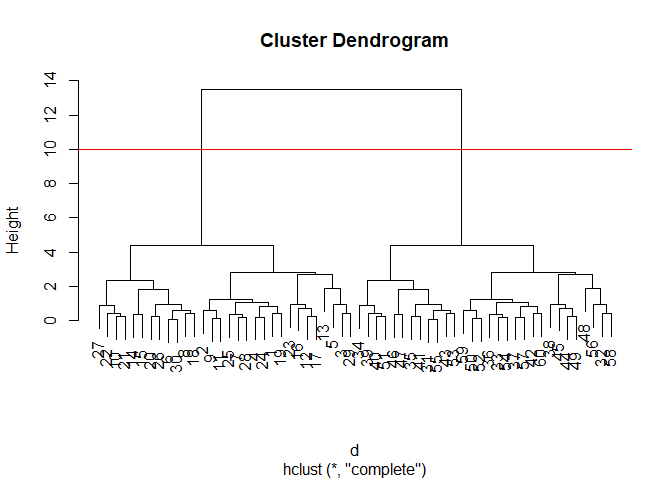

Class 7
================
Jimmi Nguyen

``` r
url <- "https://tinyurl.com/UK-foods"
x <- read.csv(url)
```

``` r
tmp <- c(rnorm(30,-3), rnorm(30,3))
x <- cbind(x=tmp, y=rev(tmp))
head(x)
```

                 x        y
    [1,] -3.847867 2.239838
    [2,] -4.520329 2.283834
    [3,] -5.528490 3.962503
    [4,] -3.525312 2.568465
    [5,] -5.131277 3.079243
    [6,] -2.901316 2.880179

Quick plot of x to see the two groups at -3,+3 and +3,-3

``` r
plot(x)
```


Use `kmeans()` function setting k to 2 and nstart = 20

``` r
km = kmeans(x, centers = 2, nstart = 20)
km
```

    K-means clustering with 2 clusters of sizes 30, 30

    Cluster means:
              x         y
    1  2.985132 -3.442180
    2 -3.442180  2.985132

    Clustering vector:
     [1] 2 2 2 2 2 2 2 2 2 2 2 2 2 2 2 2 2 2 2 2 2 2 2 2 2 2 2 2 2 2 1 1 1 1 1 1 1 1
    [39] 1 1 1 1 1 1 1 1 1 1 1 1 1 1 1 1 1 1 1 1 1 1

    Within cluster sum of squares by cluster:
    [1] 57.54082 57.54082
     (between_SS / total_SS =  91.5 %)

    Available components:

    [1] "cluster"      "centers"      "totss"        "withinss"     "tot.withinss"
    [6] "betweenss"    "size"         "iter"         "ifault"      

Q. How many points are in each cluster?

``` r
km$size
```

    [1] 30 30

Q. What ‘component’ of your results object details - cluster
assignment/membership - cluster center?

``` r
km$cluster
```

     [1] 2 2 2 2 2 2 2 2 2 2 2 2 2 2 2 2 2 2 2 2 2 2 2 2 2 2 2 2 2 2 1 1 1 1 1 1 1 1
    [39] 1 1 1 1 1 1 1 1 1 1 1 1 1 1 1 1 1 1 1 1 1 1

``` r
km$centers
```

              x         y
    1  2.985132 -3.442180
    2 -3.442180  2.985132

Q. Plot x colored by the kmeans cluster assignment and add cluster
centers as blue points

``` r
plot(x, col=km$cluster)
points(km$centers, col="blue", pch=15, cex=2)
```


Play with kmeans and ask for different number of clusters

``` r
km = kmeans(x, centers = 4, nstart = 20)
plot(x, col=km$cluster)
points(km$centers, col="blue", pch=15, cex=2)
```


# Hierarchical Clustering

This is another very useful and widely emploued clusting method which
has the advantage over kmeans in that it can help reveal the something
of true grouping in your data.

The `hclust()` function wants a distace matrix as input. We can get this
from the `dist()` function.

``` r
d = dist(x)

hc = hclust(d)
hc
```


    Call:
    hclust(d = d)

    Cluster method   : complete 
    Distance         : euclidean 
    Number of objects: 60 

There is a plot method for hclust results:

``` r
plot(hc)
abline(h=10, col="red")
```



To get my cluster membership vector I need to “cut” my tree to yield
sub-trees or branches with all the members of a given cluster residing
on the same cut branch. The function to do this is called `cutree()`

It is often helpful to use the `k=` argument to cutree rather than the
`h=` height of cutting with `cutree()`. This will cut the tree to yield
the number of clusters you want.

``` r
grps = cutree(hc, k=2)
grps
```

     [1] 1 1 1 1 1 1 1 1 1 1 1 1 1 1 1 1 1 1 1 1 1 1 1 1 1 1 1 1 1 1 2 2 2 2 2 2 2 2
    [39] 2 2 2 2 2 2 2 2 2 2 2 2 2 2 2 2 2 2 2 2 2 2

# Principle Component Analysis (PCA)

The base R function for PCA is called `prcomp()` Let’s play with some
17D data (a very small dataset) and see how PCA can help.

## PCA of UK food data

Import the data

``` r
url <- "https://tinyurl.com/UK-foods"
x <- read.csv(url)
head(x)
```

                   X England Wales Scotland N.Ireland
    1         Cheese     105   103      103        66
    2  Carcass_meat      245   227      242       267
    3    Other_meat      685   803      750       586
    4           Fish     147   160      122        93
    5 Fats_and_oils      193   235      184       209
    6         Sugars     156   175      147       139

> Q1. How many rows and columns are in your new data frame named x? What
> R functions could you use to answer this questions?

``` r
dim(x)
```

    [1] 17  5

> Q2. Which approach to solving the ‘row-names problem’ mentioned above
> do you prefer and why? Is one approach more robust than another under
> certain circumstances?

``` r
x <- read.csv(url, row.names=1)
head(x)
```

                   England Wales Scotland N.Ireland
    Cheese             105   103      103        66
    Carcass_meat       245   227      242       267
    Other_meat         685   803      750       586
    Fish               147   160      122        93
    Fats_and_oils      193   235      184       209
    Sugars             156   175      147       139

I prefer the `row.names=1` argument because it sets a specific column as
the row names while the `x[,-1]` code will delete the first row after
setting them to the row names. The `row.names` function is more robust
because you can run as many times and it will produce the same output,
while the `x[,-1]` code will continously delete rows as you run it
repeatedly.

> Q3: Changing what optional argument in the above barplot() function
> results in the following plot?

Change the beside argument to false will result in the following plot.

``` r
barplot(as.matrix(x), beside=T, col=rainbow(nrow(x)))
```


``` r
barplot(as.matrix(x), beside=F, col=rainbow(nrow(x)))
```


> Q5: Generating all pairwise plots may help somewhat. Can you make
> sense of the following code and resulting figure? What does it mean if
> a given point lies on the diagonal for a given plot?

The code is cross comparing different countries by their food
consumption. If points lie on the diagonal it means the both countries
consume the same amount in that specific food.

``` r
pairs(x, col=rainbow(10), pch=16)
```


> Q6. What is the main differences between N. Ireland and the other
> countries of the UK in terms of this data-set?

The main differences are their elevated consumption of fresh potatoes,
lower alcohol consumption, and lower fresh fruit consumption.

``` r
pca = prcomp( t(x) )
summary(pca)
```

    Importance of components:
                                PC1      PC2      PC3       PC4
    Standard deviation     324.1502 212.7478 73.87622 4.189e-14
    Proportion of Variance   0.6744   0.2905  0.03503 0.000e+00
    Cumulative Proportion    0.6744   0.9650  1.00000 1.000e+00

PCA plot

``` r
pca$x
```

                     PC1         PC2         PC3           PC4
    England   -144.99315    2.532999 -105.768945  2.842865e-14
    Wales     -240.52915  224.646925   56.475555  7.804382e-13
    Scotland   -91.86934 -286.081786   44.415495 -9.614462e-13
    N.Ireland  477.39164   58.901862    4.877895  1.448078e-13

``` r
plot(pca$x[,1],pca$x[,2], col=c("orange","red","blue","darkgreen"),pch=15)
```


> Q7. Complete the code below to generate a plot of PC1 vs PC2. The
> second line adds text labels over the data points.

``` r
plot(pca$x[,1], pca$x[,2], xlab="PC1", ylab="PC2", xlim=c(-270,500))
text(pca$x[,1], pca$x[,2], colnames(x))
```


> Q8. Customize your plot so that the colors of the country names match
> the colors in our UK and Ireland map and table at start of this
> document.

``` r
plot(pca$x[,1], pca$x[,2], xlab="PC1", ylab="PC2", xlim=c(-270,500))
text(pca$x[,1], pca$x[,2], colnames(x), col=c("orange","red","blue","darkgreen"))
```


Below we can use the square of `pca$sdev`, which stands for “standard
deviation”, to calculate how much variation in the original data each PC
accounts for.

``` r
v <- round( pca$sdev^2/sum(pca$sdev^2) * 100 )
v
```

    [1] 67 29  4  0

Summarized the variances with respect to the principal component using
the `summary()` function and then using `barplot()`.

``` r
z <- summary(pca)
z$importance
```

                                 PC1       PC2      PC3          PC4
    Standard deviation     324.15019 212.74780 73.87622 4.188568e-14
    Proportion of Variance   0.67444   0.29052  0.03503 0.000000e+00
    Cumulative Proportion    0.67444   0.96497  1.00000 1.000000e+00

``` r
barplot(v, xlab="Principal Component", ylab="Percent Variation")
```


Plotting the influences of original variables against the principal
components using the `barplot()` function which gives us loading scores.

``` r
par(mar=c(10, 3, 0.35, 0))
barplot( pca$rotation[,1], las=2 )
```


> Q9: Generate a similar ‘loadings plot’ for PC2. What two food groups
> feature prominantely and what does PC2 mainly tell us about?

Fresh potatoes with the most positive loading score and soft drinks with
the most negative loading score. PC2 tells us

``` r
par(mar=c(10, 3, 0.35, 0))
barplot( pca$rotation[,2], las=2 )
```


information also can be summarized using the `biplot()` function.

``` r
biplot(pca)
```


New data of gene expression.

``` r
url2 <- "https://tinyurl.com/expression-CSV"
rna.data <- read.csv(url2, row.names=1)
head(rna.data)
```

           wt1 wt2  wt3  wt4 wt5 ko1 ko2 ko3 ko4 ko5
    gene1  439 458  408  429 420  90  88  86  90  93
    gene2  219 200  204  210 187 427 423 434 433 426
    gene3 1006 989 1030 1017 973 252 237 238 226 210
    gene4  783 792  829  856 760 849 856 835 885 894
    gene5  181 249  204  244 225 277 305 272 270 279
    gene6  460 502  491  491 493 612 594 577 618 638

> Q10: How many genes and samples are in this data set?

There are 10 samples and 100 genes.

``` r
ncol(rna.data)
```

    [1] 10

``` r
nrow(rna.data)
```

    [1] 100

PCA and plot the results.

``` r
## Again we have to take the transpose of our data 
pca <- prcomp(t(rna.data), scale=TRUE)
 
## Simple un polished plot of pc1 and pc2
plot(pca$x[,1], pca$x[,2], xlab="PC1", ylab="PC2")
```


summary of how much variation in the original data each PC account for.

``` r
summary(pca)
```

    Importance of components:
                              PC1    PC2     PC3     PC4     PC5     PC6     PC7
    Standard deviation     9.6237 1.5198 1.05787 1.05203 0.88062 0.82545 0.80111
    Proportion of Variance 0.9262 0.0231 0.01119 0.01107 0.00775 0.00681 0.00642
    Cumulative Proportion  0.9262 0.9493 0.96045 0.97152 0.97928 0.98609 0.99251
                               PC8     PC9      PC10
    Standard deviation     0.62065 0.60342 3.348e-15
    Proportion of Variance 0.00385 0.00364 0.000e+00
    Cumulative Proportion  0.99636 1.00000 1.000e+00

barplot summary of this Proportion of Variance

``` r
plot(pca, main="Quick scree plot")
```


generate our own scree-plot.

``` r
## Variance captured per PC 
pca.var <- pca$sdev^2

## Percent variance is often more informative to look at 
pca.var.per <- round(pca.var/sum(pca.var)*100, 1)
pca.var.per
```

     [1] 92.6  2.3  1.1  1.1  0.8  0.7  0.6  0.4  0.4  0.0

``` r
barplot(pca.var.per, main="Scree Plot", 
        names.arg = paste0("PC", 1:10),
        xlab="Principal Component", ylab="Percent Variation")
```


PCA plot a bit more attractive and useful…

``` r
colvec <- colnames(rna.data)
colvec[grep("wt", colvec)] <- "red"
colvec[grep("ko", colvec)] <- "blue"

plot(pca$x[,1], pca$x[,2], col=colvec, pch=16,
     xlab=paste0("PC1 (", pca.var.per[1], "%)"),
     ylab=paste0("PC2 (", pca.var.per[2], "%)"))

text(pca$x[,1], pca$x[,2], labels = colnames(rna.data), pos=c(rep(4,5), rep(2,5)))
```


We could use the ggplot2 package here.

``` r
library(ggplot2)

df <- as.data.frame(pca$x)

# Our first basic plot
ggplot(df) + 
  aes(PC1, PC2) + 
  geom_point()
```


adding a condition specific color and sample label aesthetics.

``` r
df$samples <- colnames(rna.data) 
df$condition <- substr(colnames(rna.data),1,2)

p <- ggplot(df) + 
        aes(PC1, PC2, label=samples, col=condition) + 
        geom_label(show.legend = FALSE)
p
```


some spit and polish

``` r
p + labs(title="PCA of RNASeq Data",
       subtitle = "PC1 clealy seperates wild-type from knock-out samples",
       x=paste0("PC1 (", pca.var.per[1], "%)"),
       y=paste0("PC2 (", pca.var.per[2], "%)"),
       caption="Class example data") +
     theme_bw()
```


